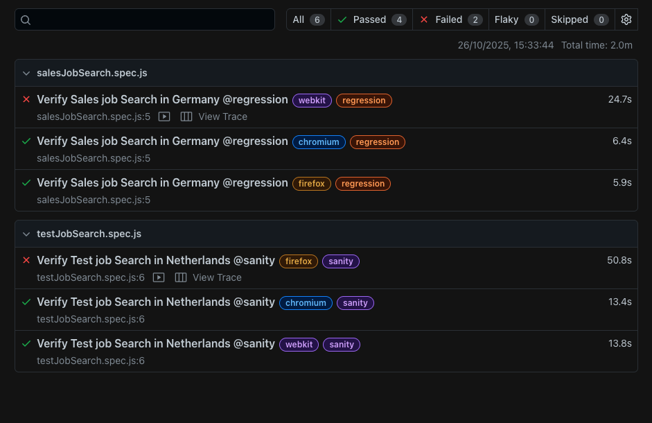

# ui-testing-playwright-javascript
UI tests Playwright JavaScript Automation Framework

A modular and scalable **end-to-end UI automation framework** built with using **JavaScript**.

This framework supports **cross-browser testing**, **Page Object Model (POM)** design, **test tagging** (smoke, sanity, regression), and **HTML reports**.

## Features

✅ Cross-browser testing — Chromium, Firefox, WebKit (Safari)\
✅ Page Object Model (POM) design pattern\
✅ Support for **smoke**, **sanity**, and **regression** test groups\
✅ Auto screenshots, trace logs, and video on failure\
✅ Rich HTML reports\
✅ Configurable base URLs, environments, and retries\
✅ CI/CD ready (GitHub Actions / Jenkins compatible)

## Project Structure

## Installation & Setup

### 1. Clone the repository
https://github.com/geethuja/ui-testing-playwright-javascript.git

Install dependencies
npm install

Install Playwright browsers
npx playwright install

### 2. Running Tests

Run all tests  
npx playwright test

Run specific test file
npx playwright test salesJobSearch.spec.js

Run tests by tag
npx playwright test --grep smoke
npx playwright test --grep sanity
npx playwright test --grep regression

Run in a specific browser
npx playwright test testJobSearch.spec.js --project=webkit
npx playwright test testJobSearch.spec.js --project=chromium
npx playwright test testJobSearch.spec.js --project=firefox  --headed

### 3. View Reports

After running tests, open the HTML report:
npx playwright show-report

This opens an interactive dashboard at:
playwright-report/index.html
